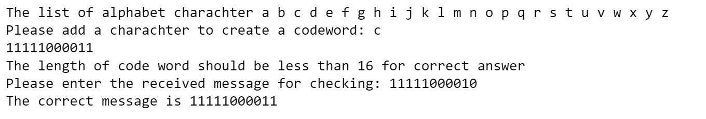

# Computer_network-CITS3002-
## Hamming's Correction of Single-Bit Errors
Let's say that a single transmission consists of m bits for the message, and r bits of seemingly redundant information. 
We thus transmit n = m + r bits when transmitting a message.
In 1950, mathematician and Turing Award winner Richard Hamming developed a method which achieves the lower bound of:

m+r+1 <= 2 r
Given a code word of 7 data bits and 4 check bits, we number the code word from 1 from the left hand side.
Each bit whose ordinal position is a power of 2 {1,2,4,8,...} is a check bit and forces the parity of some "collection" of bits including itself.
Parity may be forced to be either even or odd. I used even parity.

